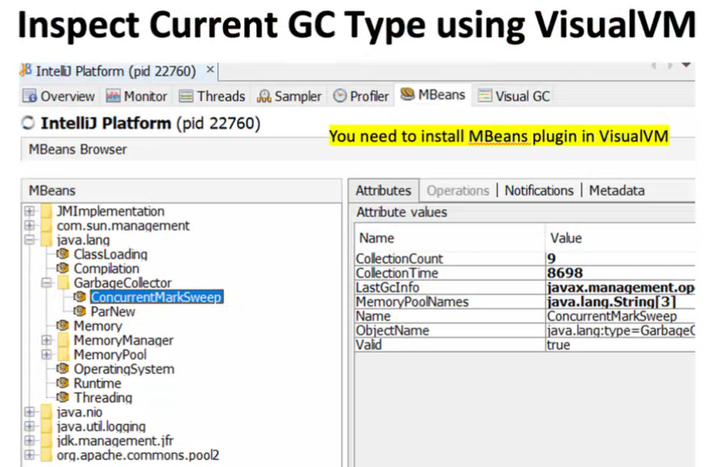

Reference Counting techniques is a way to manage memory in a program
The Garbage Collector (GC) employs this primary techniques to release unused objects.
Java gives you guarded references not memory pointers. like Pointer@3e25a5f = instance identifier
so you never get to point to memory in Java.

When you do new an object on the heap gets created and that object is associated a reference count equals initially to one.
When you assign that object to another reference, the reference count is incremented by one.
When you assign null to a reference, the reference count is decremented by one.
When the reference count reaches zero, the object is eligible for garbage collection.
So basically tracking the reference count is very easy for Java. 
Every time you assign/destroy/unassign/change the variable, it will adjust the reference counters of the objects involved. Very easy.
So we can find the reference the objects with RC in linear time.
It will just have to loop through all the objects in the heap.
In constant time, it finds out if one of the object is not used anymore.

# **Unfortunately, however, this technique is not enough.**

The problem is that objects can reference each other in a circular way.
So if you have a circular reference, the reference count will never reach zero.

# **And this is a problem called coloring graphs:**   

Reference counting, while useful in some memory management contexts, has significant limitations and is often not enough for effective garbage collection in more complex environments. Here’s when and why reference counting falls short:

Cyclic References:

Reference counting cannot handle cyclic dependencies. If two or more objects reference each other but are otherwise unreferenced by the rest of the program, they create a cycle.
Since each object in the cycle has a reference count greater than zero, reference counting fails to identify these as collectible, leading to memory leaks.
Overhead of Maintaining Reference Counts:

Every time an object is referenced or dereferenced, the reference count must be updated, which adds processing overhead.
In high-performance systems, especially those with multithreading, constantly updating reference counts can reduce efficiency and require complex locking mechanisms to ensure consistency.
Difficulty in Dealing with Concurrency:

In multi-threaded environments, reference counting can become problematic due to race conditions. Threads must synchronize access to reference counts, which complicates memory management and can lead to performance bottlenecks.
Inability to Handle Complex Memory Structures:

In real-world applications, memory structures are often complex and contain interdependent objects. Reference counting cannot keep track of transitive dependencies effectively, which limits its applicability for complex memory structures like graphs or trees with back-pointers.
High Memory Overhead:

Storing and maintaining the reference count for every object consumes additional memory, which can be significant for applications with a large number of small objects.
Limited Support for Weak References:

Reference counting does not natively support weak references or other types of non-owning pointers that are often essential in modern memory management strategies.
Weak references are critical in avoiding memory leaks for caches, observers, and other non-owning relationships.
# **How GC can Hurt You?**

**1. Performance Impact from GC Pauses (Stop-the-World Events)**

   **GC Pauses:** During garbage collection, especially for full GC cycles, the JVM may need to pause all application threads to clean up memory, known as a "stop-the-world" event.
   **Long Pauses in Full GC:** Full GC pauses can be very lengthy, particularly if you have a large heap size or a complex object graph, leading to noticeable delays.
   **Impact on User Experience:** If GC pauses occur frequently, especially in latency-sensitive applications (e.g., trading systems, gaming, or real-time applications), they can lead to noticeable delays and degrade user experience.

**2. Unpredictable Latency and Throughput Issues**

   **Latency-sensitive Applications:** In applications with strict response time requirements, such as financial applications or high-frequency trading systems, GC-induced latency spikes can be problematic.
   **Reduced Throughput:** If GC happens frequently, it can reduce overall application throughput, as more CPU cycles are dedicated to memory management rather than executing application code.

**3. Memory Fragmentation**

   **Old Generation Fragmentation:** In certain garbage collection algorithms (e.g., Concurrent Mark-Sweep, or CMS), fragmentation in the old generation space can make it difficult to allocate large contiguous blocks of memory, even if there's technically enough free space.
   **OutOfMemoryError:** Fragmentation can lead to premature OutOfMemoryError exceptions, especially if the JVM cannot find a large enough contiguous memory block to allocate new objects.

**4. High CPU Usage**

   **CPU-intensive GC Cycles:** Garbage collection, especially full GC, can be CPU-intensive and consume a significant amount of CPU time, potentially impacting the overall performance of the application.
   **Frequent Young Generation GC:** High object creation rates can lead to frequent GC cycles in the young generation, resulting in high CPU usage.

**5. Excessive Memory Allocation and Object Retention**

   **Memory Leaks:** If the application retains references to objects that are no longer needed, these objects may not be garbage collected, leading to a gradual increase in memory usage.
   **OutOfMemoryError:** Excessive object retention or high memory pressure can exhaust the heap, causing OutOfMemoryError exceptions and potentially crashing the application.

**6. GC Tuning Complexity**

   **Complex Tuning:** Finding the right garbage collector (like G1, ZGC, or Parallel GC) and configuring its parameters (heap size, young/old generation ratio, etc.) to achieve optimal performance can be challenging.
   Environment-specific Tuning: Garbage collector performance can vary significantly across different workloads and hardware, so tuning done in one environment may not perform optimally in another.

**7. Reduced Performance for Real-time or Near-real-time Applications**

   **Non-deterministic Nature:** Java’s garbage collection is not deterministic, which can be problematic for real-time or near-real-time applications that require predictable timing.
   **ZGC or Shenandoah GC:** Newer low-latency collectors (like ZGC and Shenandoah) aim to address this, but they are not always suitable for all applications due to their higher memory footprint.

**8. Impact of Large Heap Sizes**

   **Longer GC Cycles:** As the heap size grows, the time required for garbage collection increases, leading to longer pauses.
   **Memory Swapping:** Large heaps also increase the risk of memory swapping if the system doesn’t have enough physical memory, which significantly slows down performance.

**9. Potential for Application Misbehavior**

   **Soft and Weak References:** GC behavior can affect applications that use SoftReference, WeakReference, or PhantomReference. Objects with these references may be cleared unexpectedly, causing potential application issues if not handled carefully.
   **Finalize Misuse:** Reliance on finalize methods is problematic, as their execution timing is non-deterministic. Objects with finalizers may stay in memory longer than expected, increasing memory pressure.
   

# ** GC must defragment the heap, to make for large contiguous objects like String ir byte[], char[] to be allocated.
You need to compact it back to create this large chunk of space. 
To allocate a large object, because if you want to allocate the 200,000 element byte array, 
you will need 200 contiguous kilobytes.
Where do you get it from? We have to compact other objects.

# JVM splits heap into the young generation that were recently allocated and the old generation that were allocated a while ago.

# **Java Memory Model**

# This is how memory leak would look like in the heap dump.

There's an ascending trend of memory usage, and then a sudden drop. 

# Java memory size is divided into 3 parts:

**-Xms:** is the initial heap size 

**-Xmx:** is the maximum heap size 

**-Xmn:** is the young generation size

-Xms500M -Xmx2G -Xmn200M

**Usage: to speed up startup time:**
set -Xms = 1/2 of typical used heap size (eg of Eclipse/IntelliJ/batch job)

### **DO NOT set -Xms = -Xmx (max = min) -> The GC goal might be missed, and the GC will run more often.**

That's because the swapping of the memory pages is expensive.
JVM should never swap memory to disk. It should always have enough memory to run in RAM. Or GC will kill performance.

1. Set -Xmx <= Physical RAM - 0.5 GB (for the OS+thread stacks+metaspace)
2. Disable swapping on server completely: sudo swapoff -a  -> check with free -h 
link: https://www.tecmint.com/disable-swap-partition/

# Garbage Collector Types

**Serial GC:** Single-threaded, stop-the-world, good for small applications or single-core machines. XX:+UseSerialGC

**Parallel GC (aka Throughput):** Multi-threaded, stop-the-world, good for multi-core machines, default for Java < 8. XX:+UseParallelGC

**Concurrent Mark-Sweep (CMS):** Multi-threaded, concurrent, good for low-latency applications. XX:+UseConcMarkSweepGC

**G1 (Garbage First):** Multi-threaded, concurrent, region-based, good for large heaps and low-latency applications, default in Java 9+, and J8 > 4 GB. XX:+UseG1GC

**ZGC:** Low-latency, scalable, pause times less than 10ms, good for large heaps, (Java17+, enough CPU). XX:+UseZGC

